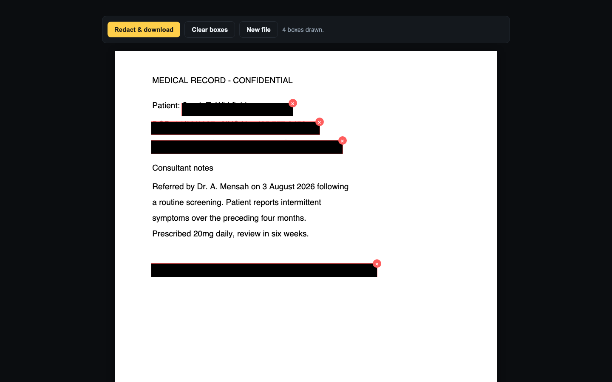

# Blackline

Black out text in a PDF so it is actually gone — not just covered up. Runs entirely in your browser; the file never leaves your computer.

**[Open Blackline →](https://p32929.github.io/blackline/)**



## Why this exists

A black rectangle drawn in Preview, Acrobat or Word sits *on top of* the text. The words are still in the file — selectable, copyable, and readable by anyone who opens it in a text editor. That is how redacted court filings and government reports keep leaking.

Blackline rebuilds every page as a flat image with your boxes burned in, then writes a fresh PDF from those images. There is no text layer left to recover, because there is no text layer at all.

## Features

- **Real redaction** — the covered characters are never written into the output file.
- **Nothing is uploaded** — your PDF is opened by your own browser. Turn off your wi-fi and it still works.
- **Metadata stripped** — title, author, subject, keywords, creator and producer come out empty. Images lose their EXIF and GPS block.
- **Images too** — JPEG, PNG and WebP, as well as PDF. Scans work the same as digital documents.
- **No account, no install, no extension** — one page, one file in, one file out.
- **Installable and offline** — it is a PWA, so after the first visit it works with no connection at all.

## Quick start

1. Open <https://p32929.github.io/blackline/>
2. Drop a PDF (or an image) onto the page.
3. Drag across anything you want removed. A red-outlined black box appears — click the × to undo one.
4. Hit **Redact & download**.

That's it. There is no step 5. (5. Star the repo :P)

## Run it on your own machine

No build step, no dependencies to install — it is static files.

```bash
git clone https://github.com/p32929/blackline.git
cd blackline
python3 -m http.server 8080
# open http://localhost:8080
```

It must be served over http (not opened as a `file://` path), because the PDF renderer is an ES module.

## Is the redaction really irreversible?

Yes, and it is checked rather than claimed. `test/README.md` describes the test that ships with this repo: a PDF containing a known canary string is redacted, and the output is then asserted to have (a) no trace of the canary anywhere in the raw bytes, (b) an empty text layer, (c) a solid-black redacted region, and (d) empty metadata — while the text you did *not* cover still renders.

## Pricing

The hosted tool is free for documents up to 3 pages, with no watermark and no signup. Longer documents need a licence key:

| | |
|---|---|
| **Pro — $39** | Unlimited pages, one person, lifetime, every device you own |
| **Team — $149** | Unlimited pages, up to 10 people in one organisation |
| **Agency — $499** | Unlimited seats, plus the right to self-host it on your own domain or offline intranet and use it on client work |

[Get a licence →](https://p32929.gumroad.com/l/blackline) · one payment, no subscription. Paste the key into the box on the site and the limit is gone.

## Licence

The Blackline source in this repository is **not** open source — see [LICENSE](LICENSE). You may read it, run it locally and use the hosted tool; redistributing it or hosting it for others needs the Agency licence. The vendored libraries in `vendor/` keep their own licences (pdf.js — Apache-2.0, pdf-lib — MIT).

## Contributing

Contributions are warmly welcomed and greatly appreciated! Whether it's a bug fix, new feature, or improvement, your input helps make this project better for everyone.

Before submitting a pull request, please:

1. Create an issue describing the feature or bug fix you'd like to work on
2. Wait for discussion and approval to ensure alignment with project goals
3. Fork the repository and create your feature branch
4. Submit your pull request with a clear description of changes

This approach helps avoid duplicate efforts and ensures smooth collaboration. Thank you for considering contributing!

## Share

[](https://www.facebook.com/sharer/sharer.php?u=https://github.com/p32929/blackline)
[](https://twitter.com/intent/tweet?url=https://github.com/p32929/blackline&text=Blackline%20-%20redact%20PDFs%20offline%2C%20in%20your%20browser)
[](https://www.reddit.com/submit?url=https://github.com/p32929/blackline&title=Blackline%20-%20redact%20PDFs%20offline%2C%20in%20your%20browser)
[](https://www.tumblr.com/share/link?url=https://github.com/p32929/blackline)
[](https://getpocket.com/save?url=https://github.com/p32929/blackline)

---

<a href="https://www.buymeacoffee.com/p32929"></a>
